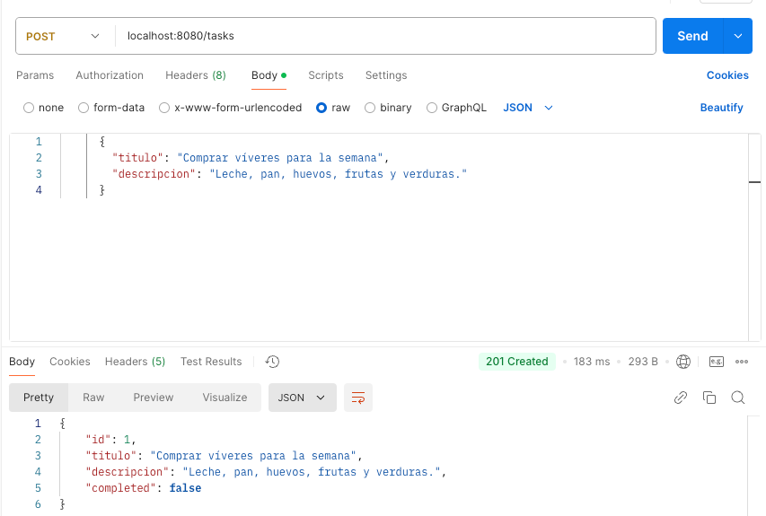
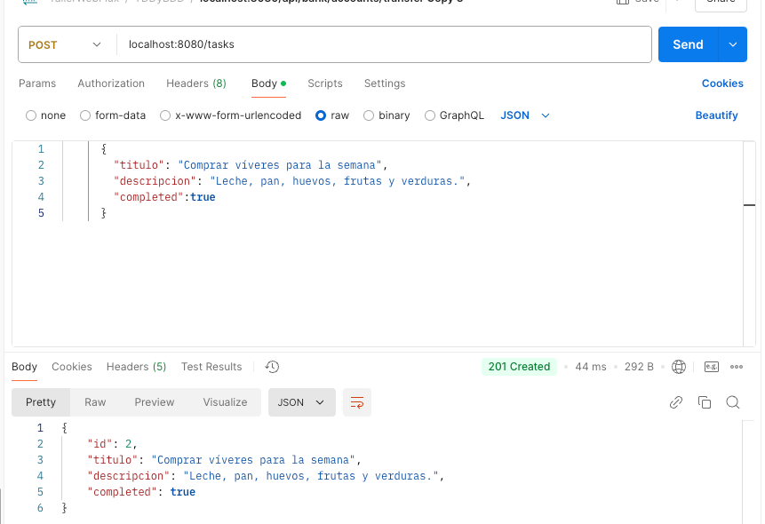
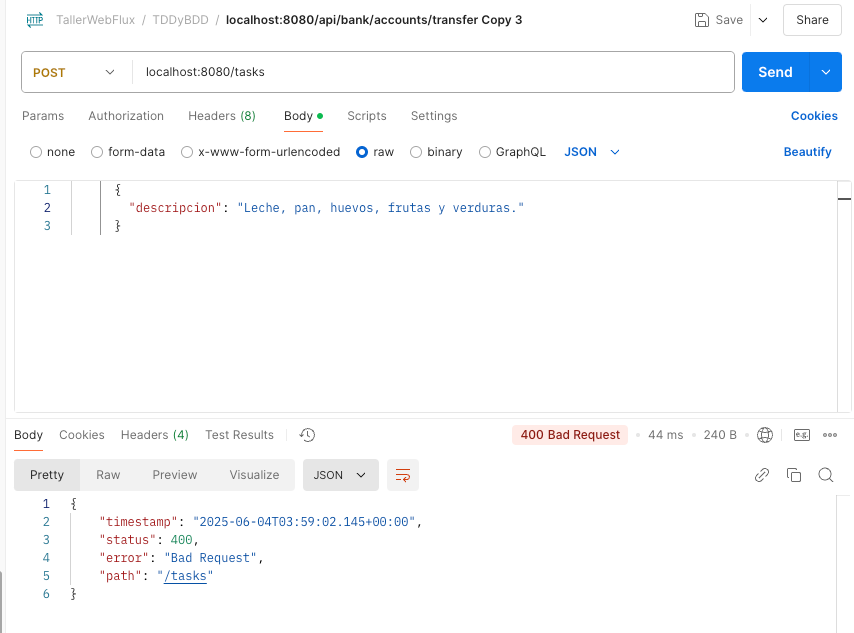
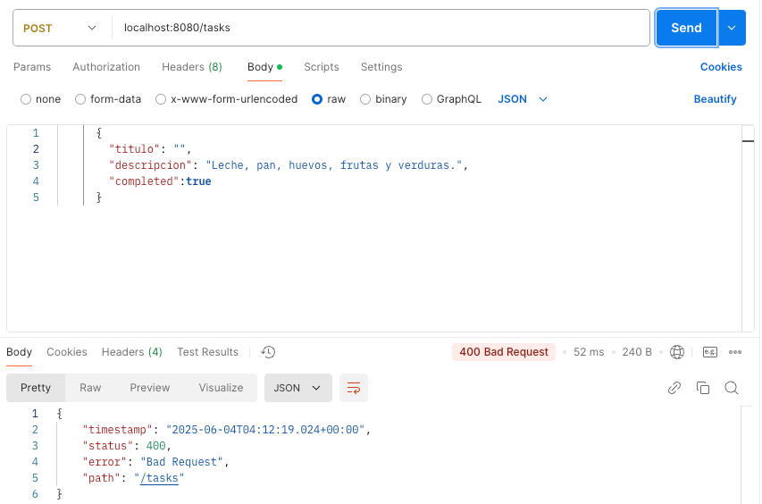
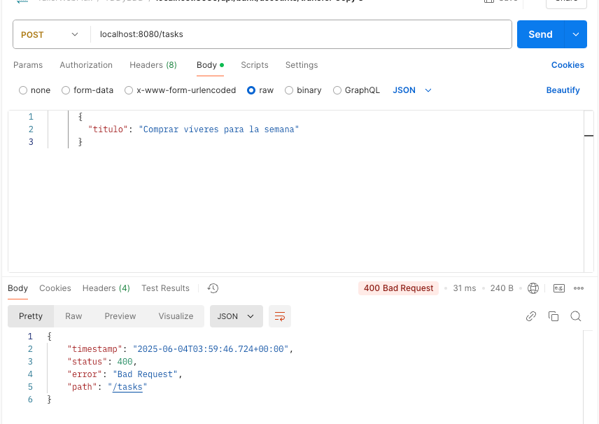
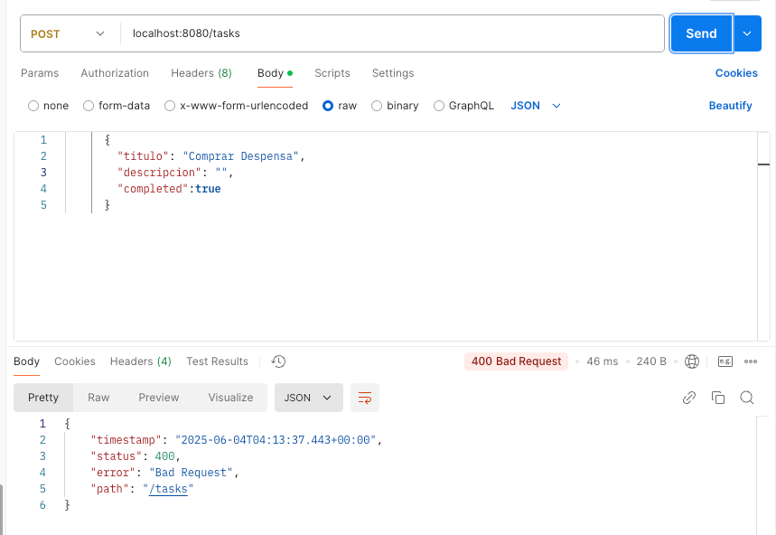
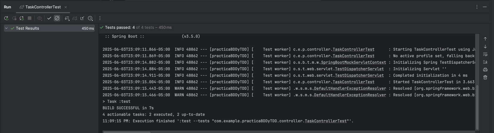
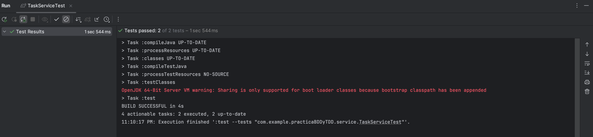

# Task Management API with BDD and TDD

## Description
This project implements a REST API for task management using **Spring Boot**. It focuses on practicing **Behavior-Driven Development (BDD)** and **Test-Driven Development (TDD)**, integrating tools like **Cucumber** for Gherkin-based tests and **JUnit** for unit and integration testing.

## Features
- **Create tasks** with title, description, and status.
- Validation of required fields (`title` and `description`).
- Data persistence in an in-memory database (H2).
- Automated testing with **Cucumber** and **JUnit**.

## Evidencias

### Las tareas deben guardarse con un campo booleano completed por defecto en false.

### Las tareas deben guardarse con un campo booleano completed e ntrue.|

### Las tareas sin titulo

### Las tareas con titulo vacio

### Las tareas sin descripción

### Las tareas con descripción vacía

## Evidencias TaskControllerTest

## Evidencias TaskServiceTest

